  

<h2 align="center">Hi, I'm Mark 👋</h2>

  <b>MS ECE @ UC San Diego</b> · Computer Engineering + Mathematics 
  Building hardware-minded software for <b>RTL</b>, <b>VLSI</b>, <b>EDA tools</b>, embedded systems, applied ML, and math.

  🌐 <a href="https://marksui.github.io/">Portfolio</a>
  · 📄 <a href="https://marksui.github.io/resume.html">Resume</a>
  · 💼 <a href="https://www.linkedin.com/in/marksui6">LinkedIn</a>

  

### ✨ Featured Projects

  A quick map of the projects I want people to open first: hardware/EDA learning tools, GPU work, embedded systems, product-style utilities, XR, and applied ML.

<table>
  <tr>
    <td width="50%">
      <b>🧩 <a href="https://marksui.github.io/logic-cmos-studio/">Logic &amp; CMOS Studio</a></b> 
      Boolean logic, K-maps, Verilog export, and CMOS visualization. 
      <a href="https://marksui.github.io/logic-cmos-studio/"><code>LIVE</code></a> <a href="https://github.com/marksui/logic-cmos-studio"><code>SOURCE</code></a> <code>TypeScript</code> <code>React</code> <code>EDA</code>
    </td>
    <td width="50%">
      <b>🎯 <a href="https://marksui.github.io/Hardware_Interview_Trainer/">Hardware Interview Trainer</a></b> 
      RTL, DV, STA, physical design, and EDA interview practice. 
      <a href="https://marksui.github.io/Hardware_Interview_Trainer/"><code>LIVE</code></a> <a href="https://github.com/marksui/Hardware_Interview_Trainer"><code>SOURCE</code></a> <code>RTL</code> <code>STA</code> <code>Local-first</code>
    </td>
  </tr>
  <tr>
    <td width="50%">
      <b>⚡ <a href="https://marksui.github.io/files/project-reports/ece268-ggm-tree-cuda-report.pdf">GPU-Accelerated GGM Tree</a></b> 
      CPU/GPU GGM tree construction with Keccak-f1600 and Spongent-128 PRF backends. 
      <a href="https://marksui.github.io/files/project-reports/ece268-ggm-tree-cuda-report.pdf"><code>REPORT</code></a> <a href="https://github.com/marksui/ECE268-GGM-Tree-Construction"><code>SOURCE</code></a> <code>CUDA</code> <code>C</code> <code>Hardware Security</code>
    </td>
    <td width="50%">
      <b>🌡️ <a href="https://marksui.github.io/Indoor_Monitoring/">Indoor Monitoring</a></b> 
      ESP32 indoor environment monitor for CO2, comfort metrics, and live room status. 
      <a href="https://marksui.github.io/Indoor_Monitoring/"><code>LIVE</code></a> <a href="https://github.com/marksui/Indoor_Monitoring"><code>SOURCE</code></a> <code>C</code> <code>ESP32</code> <code>Sensors</code>
    </td>
  </tr>
  <tr>
    <td width="50%">
      <b>🗜️ <a href="https://marksui.github.io/MacZip/">MarkMacZip</a></b> 
      Native-feeling macOS archive utility with compression, extraction, and release flow. 
      <a href="https://marksui.github.io/MacZip/"><code>PAGE</code></a> <a href="https://github.com/marksui/MacZip"><code>SOURCE</code></a> <code>Swift</code> <code>macOS</code> <code>Utility</code>
    </td>
    <td width="50%">
      <b>🈶 <a href="https://marksui.github.io/nihongo-learning/">Nihongo Learning</a></b> 
      Japanese learning website for Chinese speakers with a clean web-study experience. 
      <a href="https://marksui.github.io/nihongo-learning/"><code>LIVE</code></a> <a href="https://github.com/marksui/nihongo-learning"><code>SOURCE</code></a> <code>TypeScript</code> <code>Language</code> <code>Learning</code>
    </td>
  </tr>
  <tr>
    <td width="50%">
      <b>🥽 <a href="https://github.com/marksui/CSE165-CloserXR-Sales-Negotiator">CloserXR Sales Negotiator</a></b> 
      Mixed-reality Unity role-play with speech, Gemini dialogue, TTS, and avatar states. 
      <a href="https://github.com/marksui/CSE165-CloserXR-Sales-Negotiator"><code>SOURCE</code></a> <code>Unity</code> <code>C#</code> <code>XR</code> <code>Gemini</code>
    </td>
    <td width="50%">
      <b>🌦️ <a href="https://github.com/marksui/Kaggle-Climate-Emulation-Model-Competition">Climate Emulation Model</a></b> 
      Kaggle climate-emulation modeling workflow with ML experiments and report writing. 
      <a href="https://github.com/marksui/Kaggle-Climate-Emulation-Model-Competition/blob/main/FINAL_REPORT.pdf"><code>REPORT</code></a> <a href="https://github.com/marksui/Kaggle-Climate-Emulation-Model-Competition"><code>SOURCE</code></a> <code>Jupyter</code> <code>ML</code> <code>Climate</code>
    </td>
  </tr>
</table>

  

### ⚡ I Like Building

<table>
  <tr>
    <td align="center" width="33%">
      <b>🔬 Hardware Tools</b> 
      RTL, CMOS, timing, architecture, and EDA workflows
    </td>
    <td align="center" width="33%">
      <b>🛠️ Systems Software</b> 
      local-first utilities, embedded sensing, and clean interfaces
    </td>
    <td align="center" width="33%">
      <b>📚 Learning Products</b> 
      interactive study tools that make dense topics inspectable
    </td>
  </tr>
</table>

### 🧰 Stack

  <code>SystemVerilog</code> · <code>Verilog</code> · <code>C/C++</code> · <code>Python</code> · <code>TypeScript</code> · <code>React</code> · <code>MATLAB</code> · <code>Math</code> · <code>CUDA</code> · <code>Unity/C#</code>

